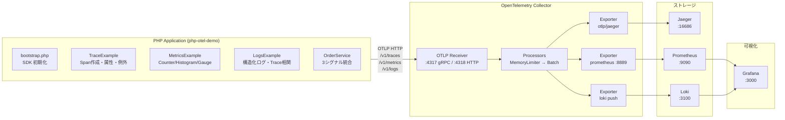
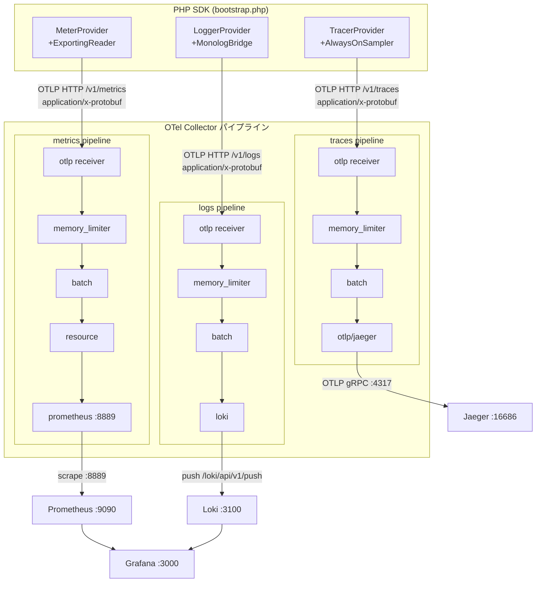
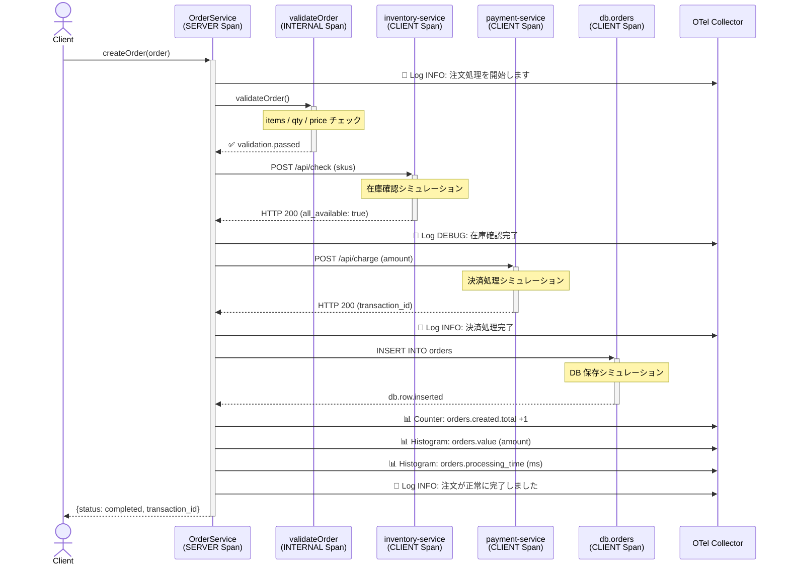

# OpenTelemetry PHP APM デモ

PHPカンファレンス向け OpenTelemetry PHP SDK の実装サンプルです。
Traces / Metrics / Logs の **3シグナル** を実際のコードで示します。

## アーキテクチャ

```
┌─────────────────────────────────────────────────────────────┐
│  PHP Application (php-otel-demo)                            │
│                                                             │
│  ┌─────────────┐ ┌──────────────┐ ┌────────────────┐      │
│  │TraceExample │ │MetricsExample│ │  LogsExample   │      │
│  │             │ │              │ │                │      │
│  │ Span作成    │ │ Counter      │ │ 構造化ログ     │      │
│  │ 属性付与    │ │ Histogram    │ │ Trace相関      │      │
│  │ 例外記録    │ │ Gauge        │ │ ログレベル別   │      │
│  └──────┬──────┘ └──────┬───────┘ └───────┬────────┘      │
│         │               │                  │               │
│         └───────────────┼──────────────────┘               │
│                         │ OTLP HTTP                        │
└─────────────────────────┼─────────────────────────────────┘
                          ▼
         ┌────────────────────────────┐
         │  OpenTelemetry Collector   │
         │  (otel-collector:4318)     │
         └──────┬──────────┬──────────┘
                │          │          │
          Traces│    Metrics│     Logs│
                ▼          ▼          ▼
         ┌──────────┐ ┌──────────┐ ┌──────┐
         │  Jaeger  │ │Prometheus│ │ Loki │
         │ :16686   │ │  :9090   │ │:3100 │
         └──────────┘ └────┬─────┘ └──┬───┘
                           │          │
                      ┌────▼──────────▼────┐
                      │      Grafana       │
                      │      :3000         │
                      └────────────────────┘
```

### システムアーキテクチャ図 (Mermaid)



### テレメトリ・シグナルパイプライン (Mermaid)



### OrderService ワークフロー (Mermaid)



## プロジェクト構成

```
.
├── docker-compose.yml           # 全サービス定義
├── otel-collector-config.yaml   # Collector パイプライン設定
├── composer.json                # PHP 依存関係
├── src/
│   ├── bootstrap.php            # SDK 初期化 (Provider / Exporter / Propagator)
│   ├── TraceExample.php         # Span 作成・属性・例外記録デモ
│   ├── MetricsExample.php       # Counter / Histogram / Gauge デモ
│   ├── LogsExample.php          # 構造化ログ + Trace 相関デモ
│   └── OrderService.php         # 3シグナル統合デモサービス
├── public/
│   └── index.php                # エントリーポイント
└── infra/
    ├── prometheus/prometheus.yml
    └── grafana/provisioning/
        ├── datasources/
        └── dashboards/
```

## セットアップ手順

### 前提条件

- Docker Desktop 4.x 以上
- Docker Compose v2 以上
- PHP 8.1 以上 + Composer (ローカル実行の場合)

### 1. リポジトリのクローン

```bash
git clone https://github.com/Fendo181/OpenTelemetryPractice.git
cd OpenTelemetryPractice
```

### 2. Docker 環境の起動

```bash
# バックエンドサービスを起動
docker compose up -d otel-collector jaeger prometheus loki grafana

# 起動確認
docker compose ps
```

### 3. デモの実行

```bash
# PHP アプリを Docker で実行
docker compose run --rm app

# または Composer インストール後にローカルで実行
composer install
OTEL_EXPORTER_OTLP_ENDPOINT=http://localhost:4318 php public/index.php
```

### 4. 結果の確認

| シグナル | ツール | URL |
|----------|--------|-----|
| **Traces** | Jaeger UI | http://localhost:16686 |
| **Metrics** | Grafana | http://localhost:3000 |
| **Logs** | Grafana + Loki | http://localhost:3000 |
| Prometheus | Prometheus UI | http://localhost:9090 |

Grafana のログイン: `admin` / `admin`

## デモ内容

### Demo 1: Tracing

- `HTTP GET /orders/42` をシミュレートしたネストした Span 構造
- DB クエリ・外部 API の CLIENT Span
- `SpanKind` による分類 (SERVER / CLIENT / INTERNAL)
- 例外の `recordException()` によるキャプチャ

### Demo 2: Metrics

| Instrument | 使用例 |
|------------|--------|
| `Counter` | HTTPリクエスト数・エラー数 |
| `Histogram` | レイテンシ分布・注文金額分布 |
| `UpDownCounter` | アクティブセッション数 |
| `ObservableGauge` | メモリ使用量 (非同期) |
| `ObservableCounter` | CPU 時間 (非同期) |

### Demo 3: Logs

- 構造化ログ（コンテキスト付き JSON）
- ログレベル別の使い分け (DEBUG / INFO / WARNING / ERROR / CRITICAL)
- アクティブな Span の `trace_id` / `span_id` を自動付与
- Monolog + OpenTelemetry ブリッジによる統合

### Demo 4: OrderService (3シグナル統合)

実際のECサイトの注文処理フローを模した統合デモ:

1. 注文受付 → `HTTP SERVER Span` 開始
2. バリデーション → `INTERNAL Span`
3. 在庫確認 → `CLIENT Span` (外部サービス呼び出し)
4. 決済処理 → `CLIENT Span` (外部サービス呼び出し)
5. DB 保存 → `CLIENT Span` (DB クエリ)
6. 各ステップで構造化ログを出力
7. 成功・失敗のメトリクスを記録

## 環境変数

| 変数名 | デフォルト値 | 説明 |
|--------|-------------|------|
| `OTEL_EXPORTER_OTLP_ENDPOINT` | `http://localhost:4318` | Collector エンドポイント |
| `OTEL_SERVICE_NAME` | `php-otel-demo` | サービス名 |
| `OTEL_LOG_LEVEL` | `info` | SDK ログレベル |

## 依存ライブラリ

| パッケージ | バージョン | 役割 |
|-----------|-----------|------|
| `open-telemetry/api` | ^1.1 | OTel API 定義 |
| `open-telemetry/sdk` | ^1.1 | TracerProvider / MeterProvider / LoggerProvider |
| `open-telemetry/exporter-otlp` | ^1.1 | OTLP HTTP/gRPC Exporter |
| `open-telemetry/opentelemetry-logger-monolog` | ^1.1 | Monolog ブリッジ |
| `monolog/monolog` | ^3.0 | ロギングライブラリ |

## クリーンアップ

```bash
docker compose down -v
```
