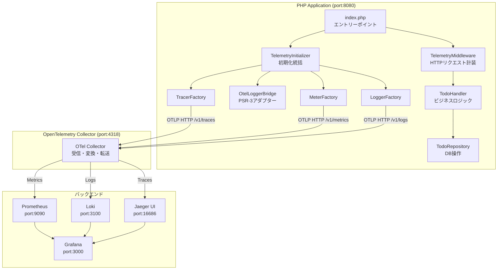
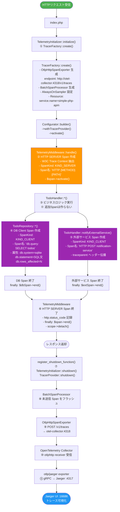
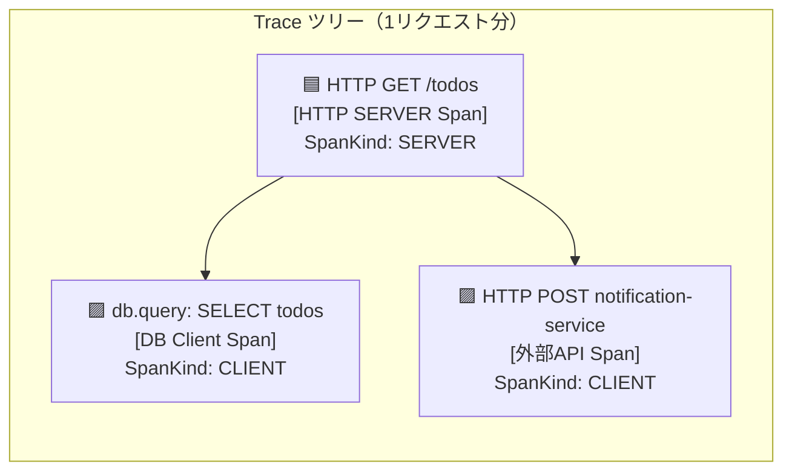
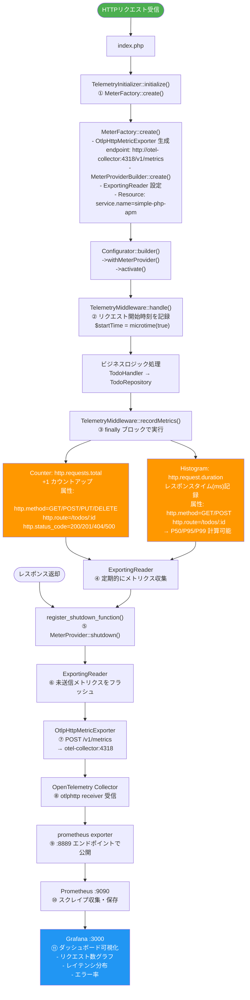
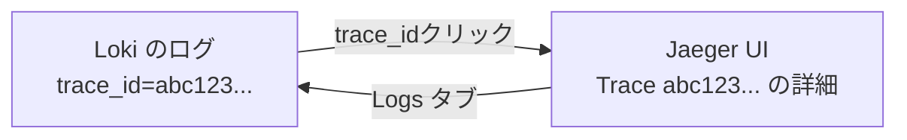
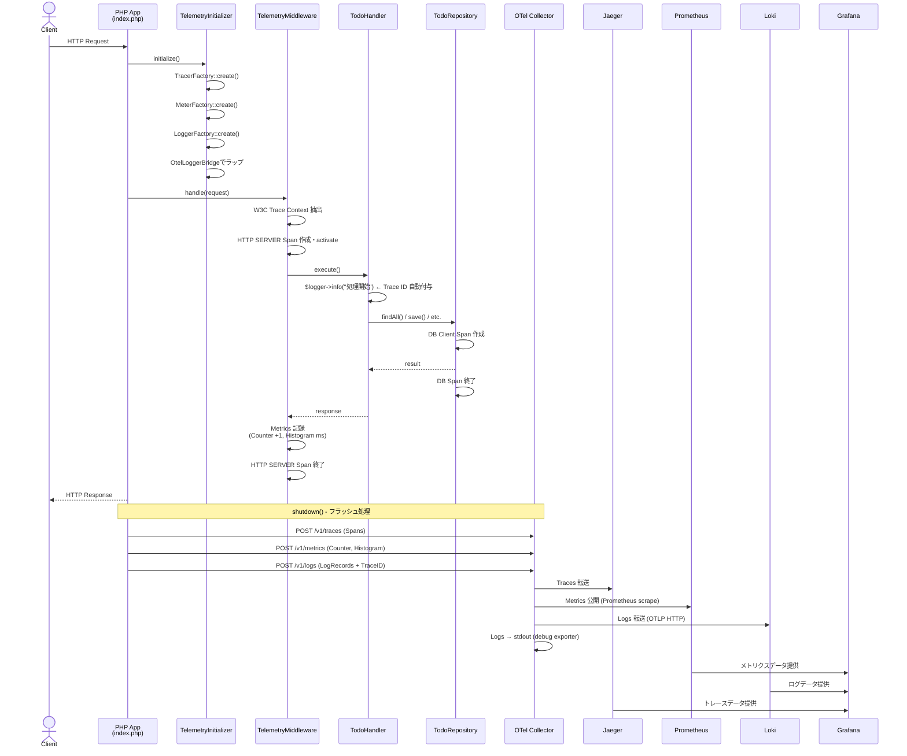
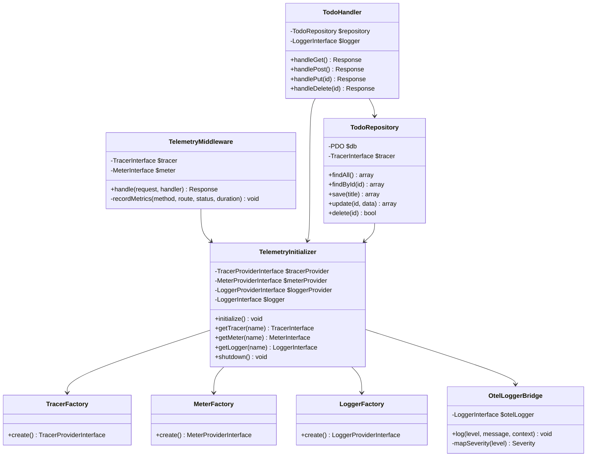
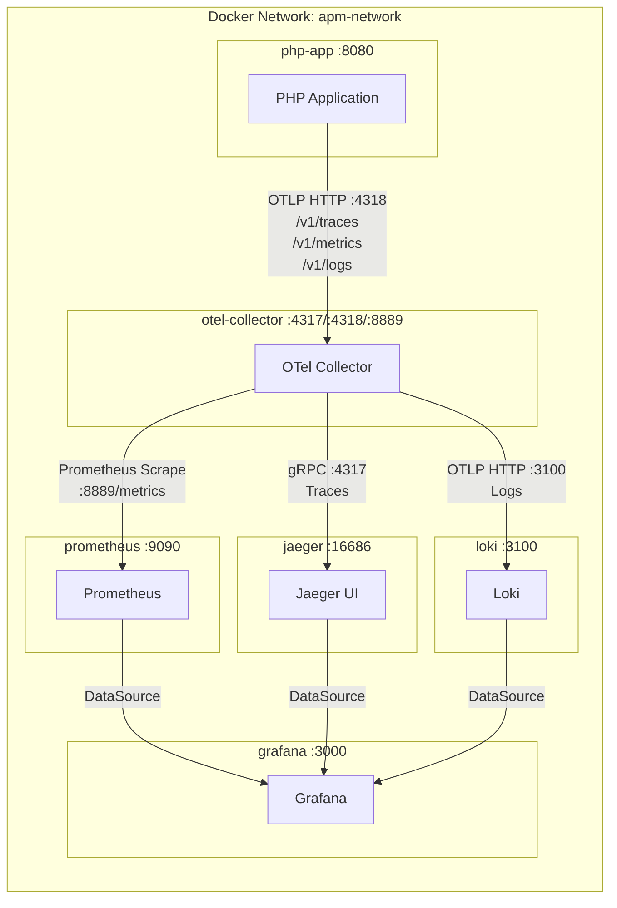

# simple-php-amp Architecture

## 概要

このドキュメントでは、`simple-php-amp` における OpenTelemetry の 3 シグナル（Traces・Metrics・Logs）がどのように送信されるかの処理フローを解説します。

---

## システム全体構成

---

## Traces（トレース）の処理フロー

### 概要

HTTP リクエストを起点に、DB 操作・外部サービス呼び出しまでを **Span** の親子ツリーで記録します。

### Span の親子関係

---

## Metrics（メトリクス）の処理フロー

### 概要

HTTP リクエストのカウントとレスポンスタイムを **Counter** と **Histogram** で記録します。

### 記録されるメトリクス一覧

| メトリクス名 | 種類 | 説明 | 属性 |
|------------|------|------|------|
| `http.requests.total` | Counter | HTTPリクエスト総数 | `http.method`, `http.route`, `http.status_code` |
| `http.request.duration` | Histogram | リクエスト処理時間(ms) | `http.method`, `http.route` |

---

## Logs（ログ）の処理フロー

### 概要

PSR-3 標準インターフェースでログを出力し、OpenTelemetry の **Trace ID** を自動的に付与します。

```mermaid
flowchart TD
    REQ([HTTPリクエスト受信]) --> IDX[index.php]

    IDX --> INIT_L["TelemetryInitializer::initialize()\n① LoggerFactory::create()"]

    INIT_L --> LF_BUILD["LoggerFactory::create()\n- OtlpHttpLogExporter 生成\n  endpoint: http://otel-collector:4318/v1/logs\n- BatchLogRecordProcessor 設定\n- Resource: service.name=simple-php-apm"]

    LF_BUILD --> BRIDGE["OtelLoggerBridge でラップ\n② PSR-3 LoggerInterface を実装\n  Psr\\Log\\LoggerInterface"]

    BRIDGE --> CONF_L["Configurator::builder()\n  ->withLoggerProvider()\n  ->activate()"]

    CONF_L --> HANDLER_L["TodoHandler::*()\n③ $logger = TelemetryInitializer::getLogger()\n  PSR-3 メソッド呼び出し"]

    HANDLER_L --> PSR3_INFO["$logger->info('Todo一覧取得成功', context)\n$logger->warning('Todo not found', context)\n$logger->error('DB接続失敗', context)"]

    PSR3_INFO --> BRIDGE_LOG["OtelLoggerBridge::log()\n④ PSR-3 → OTel Severity 変換\n\ninfo    → Severity::INFO\nwarning → Severity::WARN\nerror   → Severity::ERROR\ndebug   → Severity::DEBUG"]

    BRIDGE_LOG --> RECORD["LogRecordBuilder\n⑤ ログレコード構築\n  ->setSeverityNumber()\n  ->setSeverityText()\n  ->setBody(メッセージ)\n  ->setAttributes(context)\n  ※ 現在の Trace ID が自動付与"]

    RECORD --> CORRELATION["Trace-Log 相関\n⑥ 同一リクエストの\n  TraceId + SpanId が付与\n  → JaegerとLogs を紐づけ可能"]

    CORRELATION --> PROC["BatchLogRecordProcessor\n⑦ ログをバッチ化"]

    PROC --> SHUTDOWN_L["register_shutdown_function()\n⑧ LoggerProvider::shutdown()"]

    SHUTDOWN_L --> FLUSH_L["BatchLogRecordProcessor\n⑨ 未送信ログをフラッシュ"]

    FLUSH_L --> OTLP_L["OtlpHttpLogExporter\n⑩ POST /v1/logs\n  → otel-collector:4318"]

    OTLP_L --> COL_L["OpenTelemetry Collector\n⑪ otlphttp receiver 受信"]

    COL_L --> DEBUG["debug exporter\n⑫ 標準出力(JSON形式)\n  ※デバッグ確認用"]

    COL_L --> LOKI_EXP["otlp_http/loki exporter\n⑫ POST /otlp/v1/logs\n  → loki:3100"]

    LOKI_EXP --> LOKI["Loki :3100\n⑬ ログ保存・インデックス化\n  ラベル: service_name\n         deployment_environment"]

    LOKI --> GRAFANA_L["Grafana :3000\n⑭ Explore → Loki でログ検索\n  Trace-Log 相関も可能"]

    style REQ fill:#4CAF50,color:#fff
    style GRAFANA_L fill:#2196F3,color:#fff
    style BRIDGE fill:#FF5722,color:#fff
    style CORRELATION fill:#E91E63,color:#fff
    style LOKI fill:#F06000,color:#fff
```

### Trace-Log 相関（Jaeger ↔ Loki）

ログには **Trace ID** が自動付与されるため、Grafana から Jaeger のトレースとログを紐づけて確認できます。

- **Loki → Jaeger**: ログの `trace_id` フィールドをクリックすると該当トレースに飛ぶ
- **Jaeger → Loki**: トレース画面の Logs タブから同一 Trace ID のログを参照できる（`jaeger.yaml` の `tracesToLogsV2` 設定）

### PSR-3 → OTel Severity マッピング

| PSR-3 レベル | OTel Severity | 説明 |
|-------------|---------------|------|
| `emergency` | `FATAL4` | システム使用不可 |
| `alert` | `FATAL3` | 即時対応が必要 |
| `critical` | `FATAL2` | 重大な障害 |
| `error` | `ERROR` | エラー発生 |
| `warning` | `WARN` | 警告 |
| `notice` | `INFO2` | 通常だが重要 |
| `info` | `INFO` | 情報メッセージ |
| `debug` | `DEBUG` | デバッグ情報 |

---

## リクエスト全体の統合フロー

---

## クラス依存関係

---

## インフラ構成

### サービス一覧

| サービス | ポート | 役割 |
|---------|-------|------|
| `php-app` | 8080 | PHP アプリケーション |
| `otel-collector` | 4317 / 4318 / 8889 | テレメトリ集約・転送 |
| `jaeger` | 16686 | 分散トレーシング可視化 |
| `prometheus` | 9090 | メトリクス保存・クエリ |
| `loki` | 3100 | ログ保存・クエリ |
| `grafana` | 3000 | 統合可視化ダッシュボード |
