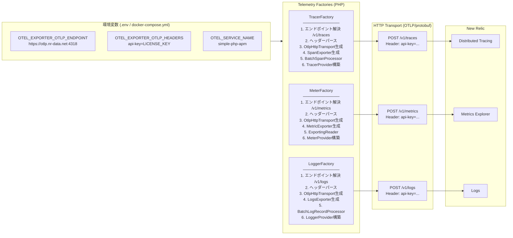

# OpenTelemetry → New Relic 送信フロー

PHP アプリから New Relic へ 3 シグナル（Traces / Metrics / Logs）を送信するまでの全体フロー。

## 設定（docker-compose.yml）

```yaml
OTEL_EXPORTER_OTLP_ENDPOINT: https://otlp.nr-data.net:4318
OTEL_EXPORTER_OTLP_HEADERS: "api-key=${NEW_RELIC_LICENSE_KEY}"
OTEL_EXPORTER_OTLP_PROTOCOL: http/protobuf
OTEL_SERVICE_NAME: simple-php-apm
```

## フロー図



## 各 Factory の責務

### TracerFactory

| ステップ | 処理 | クラス |
|---|---|---|
| 1 | エンドポイント解決 | `HttpEndpointResolver` → `/v1/traces` |
| 2 | ヘッダーパース | `OTEL_EXPORTER_OTLP_HEADERS` をパース |
| 3 | Transport 生成 | `OtlpHttpTransportFactory::create($endpoint, PROTOBUF, $headers)` |
| 4 | Exporter 生成 | `SpanExporter($transport)` |
| 5 | Processor 生成 | `BatchSpanProcessor` （バッチ化して効率送信） |
| 6 | Provider 構築 | `TracerProviderBuilder` + `AlwaysOnSampler` |

### MeterFactory

| ステップ | 処理 | クラス |
|---|---|---|
| 1 | エンドポイント解決 | `HttpEndpointResolver` → `/v1/metrics` |
| 2 | ヘッダーパース | `OTEL_EXPORTER_OTLP_HEADERS` をパース |
| 3 | Transport 生成 | `OtlpHttpTransportFactory::create($endpoint, PROTOBUF, $headers)` |
| 4 | Exporter 生成 | `MetricExporter($transport)` |
| 5 | Reader 生成 | `ExportingReader` （定期エクスポート） |
| 6 | Provider 構築 | `MeterProviderBuilder` |

### LoggerFactory

| ステップ | 処理 | クラス |
|---|---|---|
| 1 | エンドポイント解決 | `HttpEndpointResolver` → `/v1/logs` |
| 2 | ヘッダーパース | `OTEL_EXPORTER_OTLP_HEADERS` をパース |
| 3 | Transport 生成 | `OtlpHttpTransportFactory::create($endpoint, PROTOBUF, $headers)` |
| 4 | Exporter 生成 | `LogsExporter($transport)` |
| 5 | Processor 生成 | `BatchLogRecordProcessor` （バッチ化して効率送信） |
| 6 | Provider 構築 | `LoggerProvider::builder()` |

## ヘッダーパースのコード

3 つの Factory で共通して使われているヘッダーパースロジック。

```php
// OTEL_EXPORTER_OTLP_HEADERS="api-key=NRAK-XXXX" をパースして連想配列に変換
$headers = [];
foreach (explode(',', getenv('OTEL_EXPORTER_OTLP_HEADERS') ?: '') as $pair) {
    if (str_contains($pair, '=')) {
        [$key, $value] = explode('=', $pair, 2);
        $headers[trim($key)] = trim($value);
    }
}
// 結果: ['api-key' => 'NRAK-XXXX']
```

複数ヘッダーも `,` 区切りで対応：

```
OTEL_EXPORTER_OTLP_HEADERS="api-key=NRAK-XXXX,other-header=value"
```
