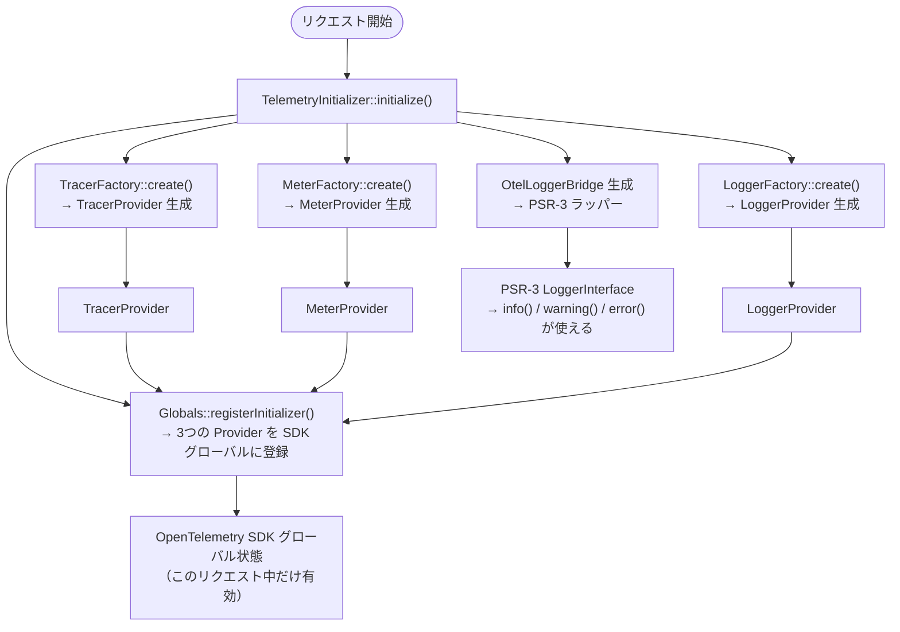
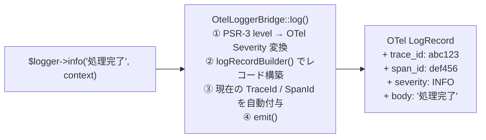
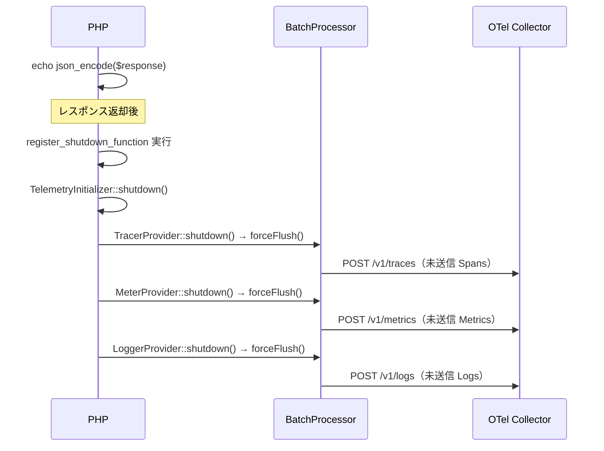
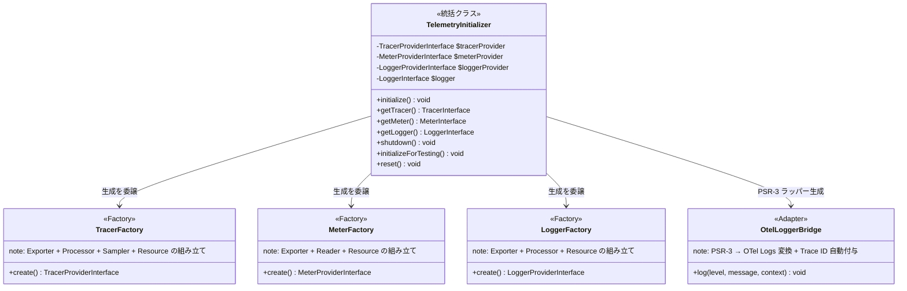

# TelemetryInitializer の設計と背景

## このドキュメントの目的

`TelemetryInitializer` は OpenTelemetry の 3 シグナル（Traces・Metrics・Logs）を初期化する中心クラスです。
なぜこのクラスが必要なのか、何をしているのかを、**PHP の特性**という背景とともに解説します。

---

## 背景：PHP の「Shared Nothing」アーキテクチャ

### 問題の根本

PHP は **リクエストごとにプロセスが完全にリセット**される言語です。

```
リクエスト A ──→ PHP プロセス起動 → 実行 → メモリ解放 → プロセス終了
リクエスト B ──→ PHP プロセス起動 → 実行 → メモリ解放 → プロセス終了
リクエスト C ──→ PHP プロセス起動 → 実行 → メモリ解放 → プロセス終了
```

これを **Shared Nothing アーキテクチャ** と呼びます。
リクエスト間で状態を共有しないため、シングルトンやグローバル変数は**リクエストをまたいで保持されません**。

### 商用 APM との違い

Datadog や New Relic のような商用 APM は、**PHP 拡張機能（C 言語実装）** としてプロセス起動時に 1 回だけ初期化します。

```
プロセス起動時に1回だけ初期化（PHP 拡張機能）
    ↓
リクエスト A → 自動計装（アプリコードの変更不要）
リクエスト B → 自動計装（アプリコードの変更不要）
リクエスト C → 自動計装（アプリコードの変更不要）
```

一方、OpenTelemetry の PHP SDK はピュア PHP 実装のため、毎リクエスト手動で初期化する必要があります。
**`TelemetryInitializer` はこの「本来なら自動化されている初期化処理」を手動で実装したクラスです。**

---

## TelemetryInitializer が行うこと

### 全体像



### 処理ステップ詳細

#### ① TracerFactory::create() — Traces の初期化

```php
self::$tracerProvider = TracerFactory::create();
```

| 生成するもの | 役割 |
|---|---|
| `OtlpHttpSpanExporter` | Collector の `/v1/traces` に HTTP で Span を送信 |
| `BatchSpanProcessor` | Span を溜めてバッチで効率的に送信（デフォルト: 5 秒 or 512 件） |
| `AlwaysOnSampler` | 全リクエストをトレース（デモ用。本番は確率サンプリングを推奨） |
| `ResourceInfo` | `service.name` などのメタデータをすべての Span に付与 |

#### ② MeterFactory::create() — Metrics の初期化

```php
self::$meterProvider = MeterFactory::create();
```

| 生成するもの | 役割 |
|---|---|
| `OtlpHttpMetricExporter` | Collector の `/v1/metrics` に HTTP でメトリクスを送信 |
| `ExportingReader` | 定期的にメトリクスを収集してエクスポート |
| `ResourceInfo` | `service.name` などのメタデータをすべてのメトリクスに付与 |

#### ③ LoggerFactory::create() — Logs の初期化

```php
self::$loggerProvider = LoggerFactory::create();
```

| 生成するもの | 役割 |
|---|---|
| `OtlpHttpLogsExporter` | Collector の `/v1/logs` に HTTP でログを送信 |
| `BatchLogRecordProcessor` | ログを溜めてバッチで効率的に送信 |
| `ResourceInfo` | `service.name` などのメタデータをすべてのログに付与 |

#### ④ Globals::registerInitializer() — SDK グローバルへの登録

```php
Globals::registerInitializer(static function (Configurator $configurator) use (...): Configurator {
    return $configurator
        ->withTracerProvider($tracerProvider)
        ->withMeterProvider($meterProvider)
        ->withLoggerProvider($loggerProvider);
});
```

`Globals` は OpenTelemetry SDK の中心的なレジストリです。
ここに登録することで、アプリケーションコードのどこからでも `Globals::tracerProvider()` などで Provider を取得できるようになります。

> **なぜ `Configurator` パターンを使うのか？**
> 直接 static プロパティに代入するより、SDK の初期化ライフサイクルに従った登録方法のため。
> テスト時にモックに差し替えやすい構造にもなっています。

#### ⑤ OtelLoggerBridge の生成 — PSR-3 アダプター

```php
$otelLogger = self::$loggerProvider->getLogger('simple-php-apm', '1.0.0');
self::$logger = new OtelLoggerBridge($otelLogger);
```

**なぜ `OtelLoggerBridge` が必要なのか？**

OpenTelemetry の `LoggerInterface` と PHP 標準の `PSR-3 LoggerInterface` はメソッドが異なります。

| インターフェース | メソッド | 問題点 |
|---|---|---|
| OTel `LoggerInterface` | `logRecordBuilder()`, `emit()` | PHP エコシステムで一般的でない |
| PSR-3 `LoggerInterface` | `info()`, `warning()`, `error()` | PHP エコシステムで標準的 |

`OtelLoggerBridge` がアダプターとして両者を繋ぎ、PSR-3 の `info()` などを OTel の `logRecordBuilder()` に変換します。
この変換時に **現在アクティブな Span の Trace ID が自動で付与**されるため、ログとトレースの相関が実現します。



---

## shutdown() の役割

```php
register_shutdown_function([TelemetryInitializer::class, 'shutdown']);
```

PHP はリクエスト終了時に `register_shutdown_function()` で登録した関数を実行します。
`shutdown()` はこのタイミングで各 Provider の `forceFlush()` を呼び出し、**未送信のデータを Collector に送信**します。



> **重要**: `shutdown()` を呼ばないとデータが Collector に届かない可能性があります。
> `BatchProcessor` は内部バッファに溜めているため、プロセス終了前に必ずフラッシュが必要です。

---

## クラス構成と責務分離



| クラス | 責務 |
|---|---|
| `TelemetryInitializer` | 初期化・取得・シャットダウンの統括。アプリコードはこのクラスだけを知ればよい |
| `TracerFactory` | `TracerProvider` の組み立てロジック（Traces 専用） |
| `MeterFactory` | `MeterProvider` の組み立てロジック（Metrics 専用） |
| `LoggerFactory` | `LoggerProvider` の組み立てロジック（Logs 専用） |
| `OtelLoggerBridge` | PSR-3 → OTel Logs への変換アダプター |

---

## テスト設計への配慮

`initializeForTesting()` と `reset()` はテスト用のメソッドです。

```php
// テスト時: モックに差し替え
TelemetryInitializer::initializeForTesting(
    $mockTracerProvider,
    $mockMeterProvider,
    $mockLogger
);

// テスト後: 状態をリセット
TelemetryInitializer::reset();
```

静的プロパティを外部から差し替えられる「継ぎ目（Seam）」を設けることで、
OpenTelemetry の実装に依存せずユニットテストが書けます（t_wada TDD の考え方）。

---

## まとめ：TelemetryInitializer が解決している課題

| 課題 | 解決策 |
|---|---|
| PHP の Shared Nothing でリクエストごとに初期化が必要 | `initialize()` を `index.php` の先頭で毎回呼び出す |
| 3 シグナルの初期化コードが各所に散らばる | `TelemetryInitializer` に一元化 |
| OTel SDK の複雑な初期化手順をアプリ側に隠蔽する | Factory パターンで組み立て詳細をカプセル化 |
| PSR-3 と OTel Logs の API 差異 | `OtelLoggerBridge` アダプターで吸収 |
| リクエスト終了時のデータ未送信リスク | `register_shutdown_function` + `shutdown()` で確実にフラッシュ |
| テスト時に実 Exporter に依存したくない | `initializeForTesting()` でモック注入を可能に |
