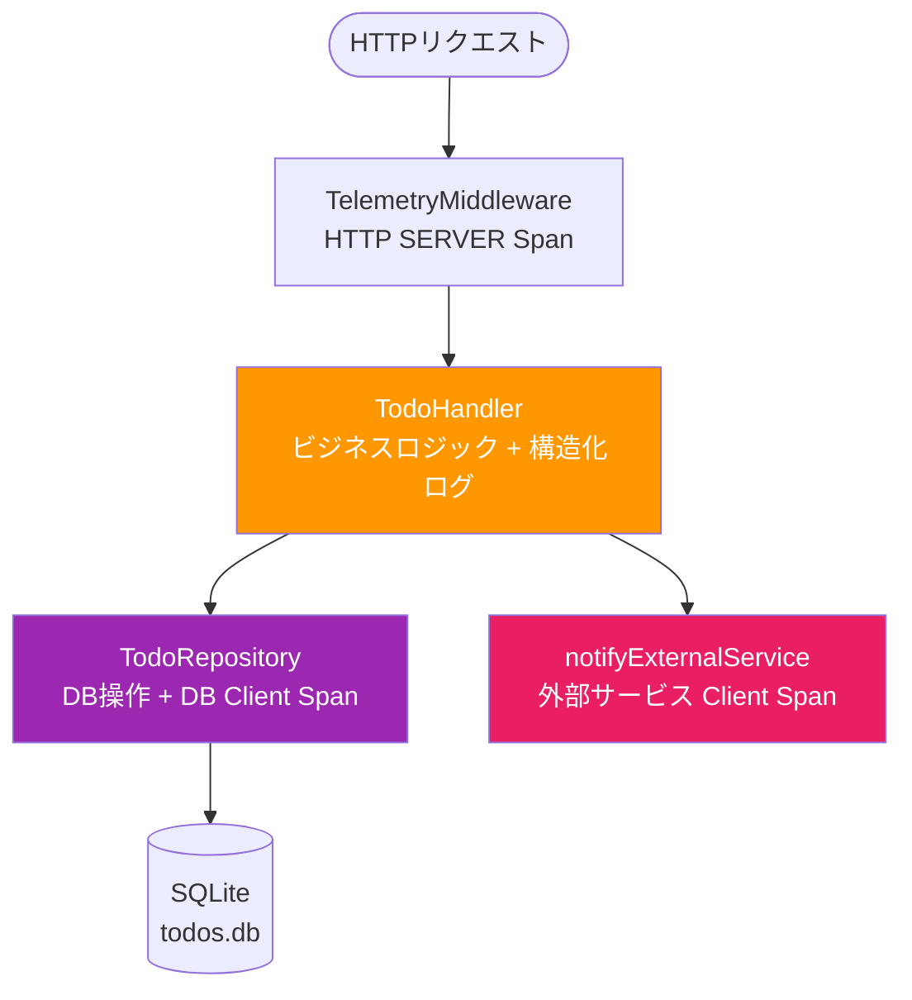
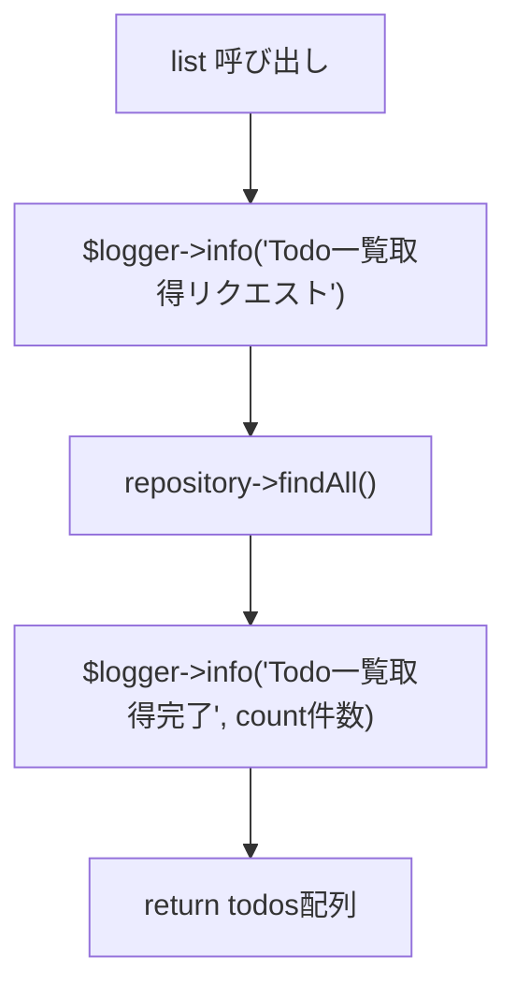
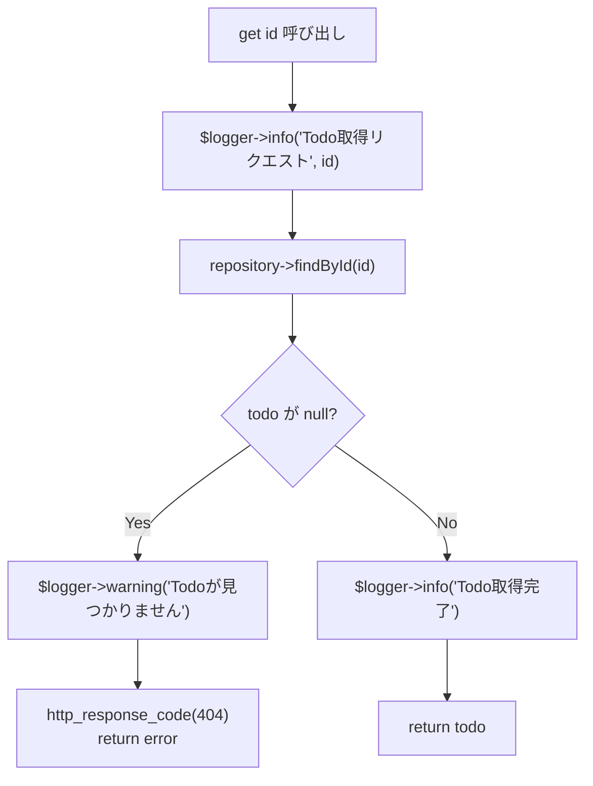
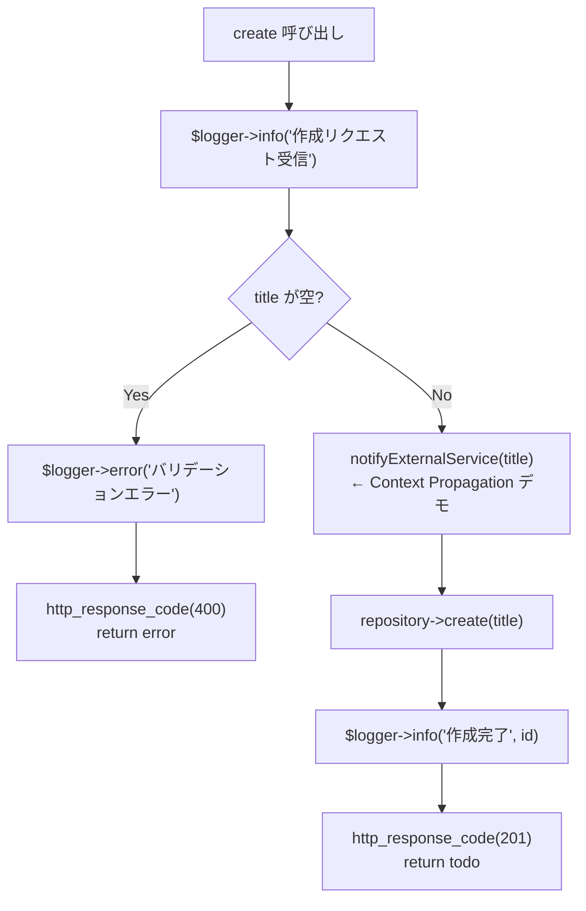
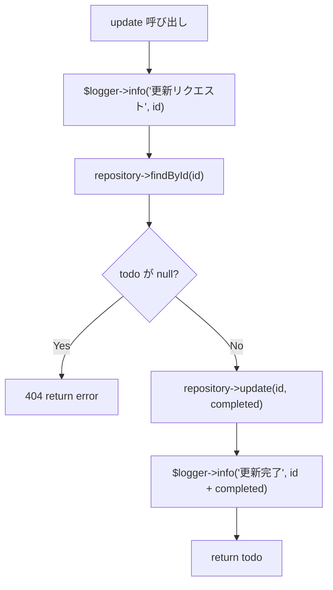
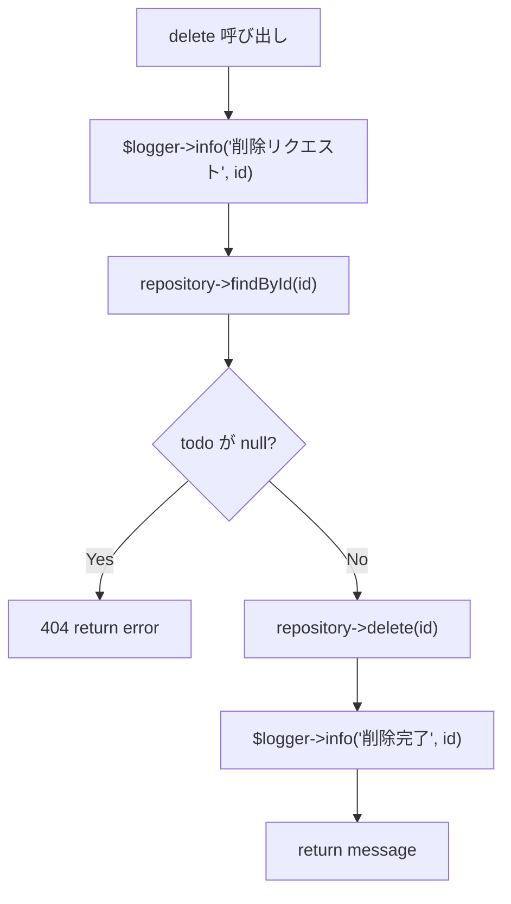
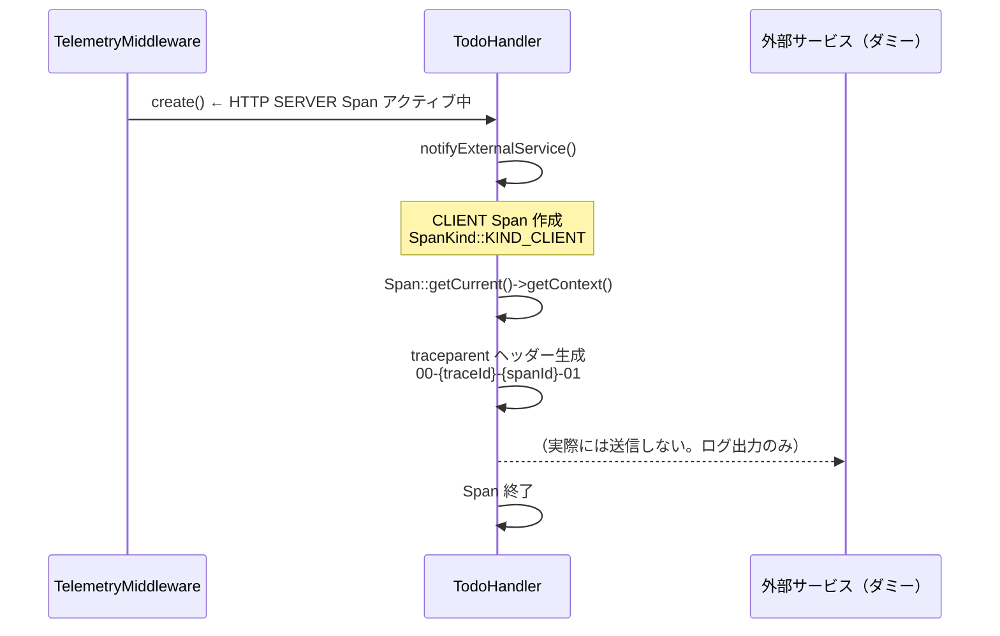
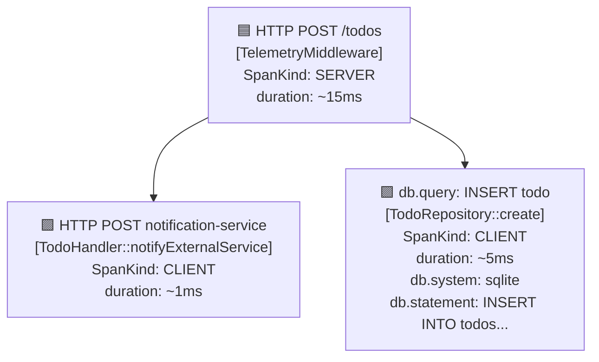

# TodoHandler / TodoRepository の設計と OpenTelemetry 計装

## このドキュメントの目的

`TodoHandler` と `TodoRepository` は Todo API のビジネスロジックと DB アクセス層です。
単純な CRUD 実装に加え、**OpenTelemetry の実践的な計装パターン**のデモとして設計されています。
このドキュメントでは「何をしているか」と「なぜそう実装しているか」を解説します。

---

## 全体の責務分担



| クラス | 層 | OpenTelemetry の役割 |
|---|---|---|
| `TelemetryMiddleware` | HTTP 層 | HTTP SERVER Span（親 Span）を作成 |
| `TodoHandler` | ビジネスロジック層 | 構造化ログ（Trace ID 付き）を出力 |
| `TodoRepository` | データアクセス層 | DB Client Span（子 Span）を作成 |

---

## TodoHandler

### 概要

REST API の各エンドポイントを担当するクラスです。
**ビジネスロジック実行** と **構造化ログ出力** の 2 つの役割を持ちます。

### CRUD エンドポイント一覧

| メソッド | エンドポイント | 処理 | 正常系レスポンス |
|---|---|---|---|
| `list()` | `GET /todos` | 全 Todo 取得 | `200 {"todos": [...]}` |
| `get(id)` | `GET /todos/{id}` | 特定 Todo 取得 | `200 {"todo": {...}}` |
| `create(input)` | `POST /todos` | Todo 作成 | `201 {"id": N, ...}` |
| `update(id, input)` | `PUT /todos/{id}` | 完了フラグ更新 | `200 {"id": N, ...}` |
| `delete(id)` | `DELETE /todos/{id}` | Todo 削除 | `200 {"message": "..."}` |

### 各メソッドの処理フロー

#### GET /todos（list）



#### GET /todos/{id}（get）



#### POST /todos（create）



#### PUT /todos/{id}（update）



#### DELETE /todos/{id}（delete）



---

### 構造化ログ（Trace-Log 相関）

すべてのメソッドで `TelemetryInitializer::getLogger()` を使って構造化ログを出力します。

```php
$logger = TelemetryInitializer::getLogger();
$logger->info('Todo作成完了', ['id' => $id, 'title' => $input['title']]);
```

**ポイント：ログに Trace ID が自動付与される**

`OtelLoggerBridge` を通して出力されるため、現在アクティブな Span の Trace ID と Span ID が自動的にログレコードに含まれます。

```
{
  "severity": "INFO",
  "body": "Todo作成完了",
  "attributes": { "id": 42, "title": "買い物" },
  "trace_id": "abc123...",   ← 自動付与
  "span_id":  "def456..."    ← 自動付与
}
```

これにより Grafana Explore（Loki）でログの `trace_id` をクリックすると、対応する Jaeger のトレースに直接ジャンプできます。

**ログレベルの使い分け**

| レベル | 使用箇所 | 例 |
|---|---|---|
| `info` | 正常系の処理開始・完了 | `'Todo作成完了', ['id' => $id]` |
| `warning` | 業務的な異常（404 等） | `'Todoが見つかりません', ['id' => $id]` |
| `error` | バリデーション失敗 | `'バリデーションエラー: タイトルが空です'` |

---

### notifyExternalService — Context Propagation のデモ

`create()` 内で呼ばれるプライベートメソッドで、**マイクロサービス間の Trace ID 伝播**を示すデモです。



**traceparent ヘッダーとは？**

W3C Trace Context 仕様で定められた、マイクロサービス間で Trace ID を伝播させる HTTP ヘッダーです。

```
traceparent: 00-{32桁のTraceID}-{16桁のSpanID}-{フラグ}
例: 00-4bf92f3577b34da6a3ce929d0e0e4736-00f067aa0ba902b7-01
```

受け取った外部サービスがこのヘッダーを `TelemetryMiddleware` で抽出すると、同一トレースとして Span が繋がります（これが分散トレーシングの仕組みです）。

```php
// 実際にマイクロサービスに送る場合のイメージ
$client->post('http://notification-service/notify', [
    'headers' => ['traceparent' => $traceParent],
    'json'    => ['title' => $title],
]);
```

---

## TodoRepository

### 概要

SQLite への CRUD 操作を担当するクラスです。
**商用 APM が自動計装している「DB クエリの Span 化」を手動で実装**しています。

> Datadog・New Relic は PDO/MySQLi をフックして DB Span を自動生成する。
> このクラスはその「自動化されている部分」を手動で見える形で実装している。

### DB Span の構造

各メソッドは以下のパターンで DB Client Span を作成します。

```php
$span = $tracer->spanBuilder('db.query: SELECT todos')
    ->setSpanKind(SpanKind::KIND_CLIENT)  // DB クライアント = KIND_CLIENT
    ->startSpan();

$scope = $span->activate();

try {
    $span->setAttribute('db.system', 'sqlite');      // DB 種別
    $span->setAttribute('db.name', 'todos.db');      // DB 名
    $span->setAttribute('db.statement', 'SELECT...'); // 実行 SQL

    // クエリ実行
    $result = $this->db->query('...');

    $span->setAttribute('db.rows_affected', count($result)); // 取得件数

    return $result;

} finally {
    $span->end();      // 必ず Span を終了
    $scope->detach();  // 必ず Scope を解除
}
```

**`finally` ブロックで終了する理由**

例外が発生しても Span が必ず終了するよう `finally` に記述します。
`finally` を忘れると Span が閉じられず、Jaeger で duration が計測されない Span が残ります。

### CRUD メソッドと Span 属性一覧

| メソッド | Span 名 | 追加属性 |
|---|---|---|
| `findAll()` | `db.query: SELECT todos` | `db.rows_affected` |
| `findById(id)` | `db.query: SELECT todo by id` | `db.todo_id` |
| `create(title)` | `db.query: INSERT todo` | `db.todo_title`, `db.todo_id`（挿入後） |
| `update(id, completed)` | `db.query: UPDATE todo` | `db.todo_id`, `db.todo_completed` |
| `delete(id)` | `db.query: DELETE todo` | `db.todo_id` |

### OpenTelemetry Semantic Conventions（DB 属性）

OTel は DB 計装の属性名を [Semantic Conventions](https://opentelemetry.io/docs/specs/semconv/database/) として標準化しています。
統一された名前を使うことで、Jaeger や Grafana の検索・フィルタリングが一貫して機能します。

| 属性名 | 値（例） | 意味 |
|---|---|---|
| `db.system` | `sqlite` | DB の種類（mysql / postgresql 等） |
| `db.name` | `todos.db` | データベース名 |
| `db.statement` | `SELECT * FROM todos...` | 実行した SQL |
| `db.rows_affected` | `5` | 取得・更新件数 |
| `db.todo_id` | `42` | 対象 Todo の ID（カスタム属性） |
| `db.todo_title` | `"買い物"` | 作成 Todo のタイトル（カスタム属性） |
| `db.todo_completed` | `true` | 完了フラグ（カスタム属性） |

---

## Jaeger で見えるトレースツリー（POST /todos の例）



1 回の `POST /todos` リクエストで **3 つの Span** が生成され、親子関係でツリーを形成します。

---

## テスト設計への配慮（依存性注入）

両クラスともコンストラクタでモックを注入できる「継ぎ目（Seam）」を持ちます。

```php
// TodoHandler のテスト例
$mockRepository = $this->createMock(TodoRepository::class);
$mockRepository->method('findAll')->willReturn([...]);

$handler = new TodoHandler($mockRepository); // モックを注入
$result = $handler->list();
```

```php
// TodoRepository のテスト例
$mockDb = new \PDO('sqlite::memory:'); // インメモリ SQLite を注入
$repo = new TodoRepository($mockDb);
```

本番コードでは `null` を渡せば実際の SQLite / Repository が使われます（デフォルト引数）。

---

## まとめ：このコードが示す計装パターン

| パターン | 実装箇所 | 解説 |
|---|---|---|
| **構造化ログ + Trace-Log 相関** | `TodoHandler` の各メソッド | `info()` / `warning()` / `error()` で Trace ID を自動付与 |
| **DB Client Span** | `TodoRepository` の各メソッド | `SpanKind::CLIENT` で DB 操作を計装 |
| **Semantic Conventions** | `TodoRepository` の `setAttribute` | `db.system`, `db.statement` など標準属性名を使用 |
| **Context Propagation** | `notifyExternalService()` | `traceparent` ヘッダーを生成してマイクロサービス間伝播を示す |
| **finally によるリソース解放** | 全 Span 作成箇所 | 例外時も確実に `span->end()` / `scope->detach()` を呼ぶ |
| **依存性注入（Seam）** | 両クラスのコンストラクタ | テスト時にモック/インメモリ DB を注入可能 |
